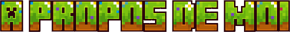
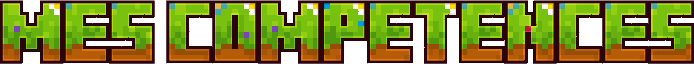

---

Salut !
Comme y a marqué en gros et en violet au dessus, je suis **Tonmou8128**, lycéen, *programmeur* pendant mon temps libre.

Mon jeu vidéo favori, **Minecraft** (*Bedrock* hein, les rageux je vous vois), permet une *quasi*-totale expression de la créativité des joueurs, et c'est grâce à ce jeu que je suis tombé dans le monde de l'informatique. Ducoup j'ai appris le fonctionnement des **packs de comportement**, en me spécialisant dans le domaine du **script API**. Plus tard, j'ai étudié et appris le fonctionnement et le développement de serveurs via le software **PocketMine-MP**.

Parallèlement, j'étudie le langage **Python** en cours.

Je suis activement engagé dans l'un des serveurs pvp-faction moddés principal sur Bedrock, **Histeria**, où je m'occupe de toute la partie événementielle.

Aoui, je suis - on va dire plus ou moins - *germanophone*.

---

On va faire une tier-list tiens.

| Tier | Langages de programmation |
| --- | --- |
| *Très bon* | Markdown - Scratch (aka ce sont même pas des "langages de programmation" mais faut bien remplir le trou mdr) |
| *Bon* | Python - JavaScript |
| *Vzy ça va encore* | HTML - PHP |
| *Je connais mais pas + que ça* | CSS |
| *J'ai pas tenu 2 minutes* | Arduino :') |
